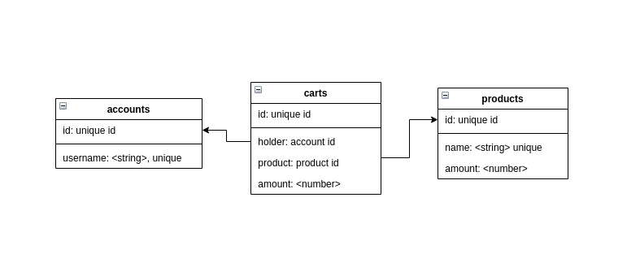

# Products-depot-handler

## Description

This project started with below instructions:

---

We would like to be able to handle stock of products in our warehouse.

Features:

- View the stock available for a specific product
- Hold a stock
- Release a stock
- Confirm the stock mouvement (remove the stock)
- Add stock with secure access

To do:

- Make all those features usable by an API
- Use Docker to let us using you API easily
- Write API DOC in the project
- Write some tests

---

And is completed after with my idea:

This project presents a backend API server of a products depot.

There are an administrator commands which can add new user accounts, new products, it can also delete account, increase or decrease a number of products in stock.

There are also secured (by apiKey) public commands to list products, to list what products are held by an user account, to hold new products, to increase and decrease a number of held products and to take out from the depot held products. If an account is deleted without moving out the held products, products will be returned to the depot stock.

This service is implemented with Node `require/module.exports` syntax (instead of ESM `export/import` syntax) because I am using Node.js v12 on my laptop, and `export/import` is only an experimental module.
The code is packaged in a docker image to easily deploy and test.

Implementation progress can be seen in the changelog file, but it is really accurate. (It is mainly for myself: I update a version each time I take a break.)

For beginning, I used the stack listed below to implement the project, because I am more familiar with those tech:

```

Express

MongoDB (via mongoose)

REST API

Jest

Supertest

```

If I have time, I also want add features like graphql API (`express-graphql or apollo-server-express`), change`MongoDB` by `PostgresQL via`Objection + knex + pg`, create a customized error class, try to convert code in typescript and add a metric producer for monitoring better.

```

Express

Mongoose or Objection + knex + pg  (to be able to configure)

REST API or Graphql API  (to be able to configure)

Jest

Supertest

```

Work progress can be see non my github repository ([here|https://github.com/akdj/demo-stock-handler]), but I recommande to see it in the `CHANGELOG.md` file.

And finally, we can discuss about pro and con of features, the bad and good points in my work, etc., In the next step. (if there is a technical review interview)

_Note_: I chose to try Objection because it is a new ORM which is growing up in trends and the benchmark that I found about this ORM, look nice https://github.com/emanuelcasco/typescript-orm-benchmark
_Note_: There is another good painless ORM named Bookshelf, created by the same author of Knex, I recommend you to check. (I used it before at work.)

_Another note again..._: I will write at the [bottom](#afterwork) of this readme, last words about the project, where I stop when reach deadline and what I should do or not do for future projects.

## Configuration

Configuration can be done by declaring environment variables or by editing the dotenv file `.env` in `src` folder. Same case for using docker.

_Note_: Default configuration is normally enough to run this API application.

List of config value:

```Bash

# Common part
# nodejs environment variable (<string>, ['development', 'production', 'staging', 'test'], default: 'development')
NODE_ENV=development


# Server part
# type of api (<string>, ['rest', 'graphql'], default: 'graphql')
API_TYPE=rest
# API server port (<string>, default: 'http')
API_PROTOCOL=http

# API server protocol (<number>, default: 8080)
API_PORT=8080

# basic authentication login (<string>, default: 'admin')
API_ADMIN_LOGIN=admin

# basic authentication password (<string>, default: 'admin')
API_ADMIN_PASSWORD=admin

#  jtw token secret, usable only if graphql api is enabled (<string>, default: 'admin-sercret')
API_GRAPHQL_ADMIN_TOKEN_SECRET="admin-secret"

# apiKey value (<string>, default: 'apikey ABCD')
API_APIKEY_VALUE="apikey ABCD"

# server ssl key path (<string>, default: undefined)
API_SSL_KEY="{path}/server.key"

# server cert path (<string>, default: undefined)
API_SSL_CERT="{path}/server.cert"


# Rate limiter feature part
# max number of request in a time window (<number>, default: 5)
RATE_MAX_COUNTS=5

# time window in second (<number>, default: 1)
RATE_WINDOW_DURATION=1


# Database Part

# database type (<string>, default: 'postgresql')
DATABASE_TYPE=mongo

# database host address (<string>, default: 'localhost')
DATABASE_HOST=localhost

# database connection username (<string>, default: 'postgres')
DATABASE_USERNAME

# database connection password (<string>, default: 'postgres')
DATABASE_PASSWORD

# database name (<string>, default: 'products_depot_db')
DATABASE_NAME=test_db

# not used by mongo. Knex's pool min (<number>, default: 1)
DATABASE_POOL_MIN=1

# not used by mongo. Knex's pool max (<number>, default: 5)
DATABASE_POOL_MAX=5

# not used by mongo. Knex's migration path (<number>, default: migration folder in source code)
DATABASE_MIGRATIONS_PATH="migrations/path"

# not used by mongo. Knex's migration path (<number>, default: seeds folder in source code)
DATABASE_SEEDS_PATH="seeds/path"


# Logger part
# logger mode (<string>, ['info', 'debug', 'error', 'warning'], default: 'debug')
LOG_LEVEL=debug

# log file prefix (<string>, default: 'service')
LOG_FILE=service

# log file output path (<string>, default: './logs')
LOG_PATH="./logs"

#log file max size (<number>, default: 1024000)
LOG_FILE_MAXSIZE=1024000

# max number of log files - circular usage (<number>, default: 3)
LOG_MAXFILES=3


# Monitor part
# enable to monitor express API (<boolean>, default: true)
MONITOR_ENABLE=true

# metric server port (<number>, default: 7777)
MONITOR_PORT=7777

```

## Commands

**In project root directory**

### To prepare

Get packages:

```

yarn install --production

```

**Prepare your configuration file (dotenv file): `.env` or your set of environment variables.**
You can find a script in `scripts` folder for generating ssl certificates for server's https security.

- If you want to use MongoDB as database, you can just run for docker format:

```
docker run -d --name=mongodb --network=host mongod
```

- If you are using PostgresQL as database, you need to create firstly a database. Here is the command line for docker format:

```

docker run -d --name=postgres --network=host -e POSTGRES_USER=postgres -e POSTGRES_PASSWORD=postgres -e POSTGRES_DB=products_depot_db postgres

```

_Note_: I use `--network=host` because I known those services' port are not used by my machine.

_for PostgresQL, you have to prepare tables with this migration command_:

```

npx knex --knexfile ./src/database/postgresql/knexfile.ts migrate:latest
or
yarn knex:migration

```

### To run

```

yarn start

```

### To test

( please see [Test](#Test) section for integration tests using postgrsql)

```

yarn test

```

### To build

```

yarn build

```

### To run as docker (with `docker-compose`)

```

docker-compose up

```

## API Design

### REST

The REST design is described with the openapi.yaml file or you can read that by running the api application in `development` mode, on `/rest-api-doc` endpoint.

run command: `NODE_ENV="development" API_TYPE="rest" yarn dev"

All commands are secured by apiKey (if provided) and admin commands have additional security access basic authentication.

**Note**: We cannot use POST commands to increase or decrease already registered/held product. Have to use PATCH commands.

### Graphql

The trends (https://www.npmtrends.com/apollo-server-vs-express-graphql-vs-graphql-yoga-vs-prisma-vs-apollo-server-express) suggest using apollo-server-express. So I chose this module instead of express-graphql (I know it is a very good one too, I used for my personal project and I want to discover new tech.).

The Graphql design can be read in `src/api-graphql` folder or by running the api application in `development` mode, on `/graphql` endpoint.

Run command: `NODE_ENV="development" API_TYPE="graphql" yarn dev"

**Note**: this Graphql API is not the mirror of the REST API, It has more commands, for instance for getting user account data.

All commands are secured by apyKey (if provided) and admin commands have additional security access with a token. The token generation is based on a username and a password encrypted with `bcrypt` module then transform to a jwt token. The server token will be logged by the logger in "debug" mode in a `development` environment.

_Note_: As I didn't set an expiration time, all tokens base on the same username/password will be considered as valid tokens.

_Note_: There is a `openapi-to-graphql` module (see https://www.npmjs.com/package/openapi-to-graphql) that can easily convert an openapi doc into a graphql schema and then build api server with `express-graphql`. But it is not the purpose of this project.

### Plus

I also added a middleware of rate limitation for HTTP input, it uses MongoDB or In-Memory storage for counting requests.

## Datamodel Design



As you can see, account table, product table and cart table.
Each time an account user holds an amount of a product, the product amount in product table will decrease. It will decrease if the user releases an amount of this product.

## Test

### Unit tests

For unit test, I didn't implement all functions' tests, because I am worried about the remaining time.
So for `controllers` and `queries` I only implemented tests for a few functions, for proving my capability to implement unit test with Jest. (I can also do Mocha, Chai, Sinon and Istanbul coverage. I choose Jest because it has more features by itself.)

### Integration tests

#### REST API

Integration tests are implemented using `Supertest`. I didn't implement full use-cases tests because of the same reason for unit tests implementation. (In fact, with what I already implemented as integrations tests, full use-cases tests will be _"copy/past"_ of those tests with ordering logic)

#### Graphql API

As for REST API, tests are implemented using `Supertest`. As with `Resolvers Chains` feature, Graphql API have more flexibility than REST API, use-cases are almost fully tested.

#### Database for tests

I am using an in-memory MongoDB for testing with MongoDB mode and a docker PostgresQL for PostgresQL mode.

For PostgresQL mode integration tests, you have to prepare the database before starting test, because I didn't implement the tear-up and tear-down processes:

- Create two databases, one for Graphql tests, another one for REST tests.
- Then you can edit the configuration knexfile to create tables, (the `.env` file, then `yarn run knex:migration`)

_Note: I forced databases' name in `api-graphql.test.js` and `api-rest.test.js` in tests/integration folder, you ould change them._
_Note: Probably, some tests in `tests/units` will failed, because it based on MongoDB configuration for instance tests in `config.test.js`. I admit config tests are a little useless, you can remove them.`_

# Final words <a name="afterwork"></a>

At the end, I succeed to implement a API project in Node.js and converted it to Typescript, with Rest design and also with GraphQL which is tricky to do. I also made the service supports NoSQL database (MongoDB) and SQL datadase (PostgresQL), add a rate limiter, a logger and try some new modules, like Objection.js, Dotenv, Jest, Supertest.

If I have time, I like to add an Extended Error class, for handling internal error type, for instance, request parameters validation, database errors, to send more precise error status in request's response. I also would like to add a context store for sharing data like request Id between features and have more precise logs tracking. Also, add a more complete metric generator feature would be better.

I also would like to thank people let me work on this project.
